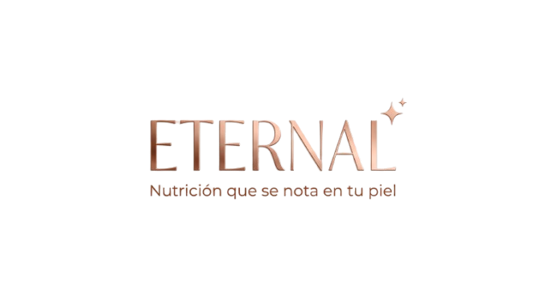

<html lang="es" class="scroll-smooth">
<head>
    <meta charset="UTF-8">
    <meta name="viewport" content="width=device-width, initial-scale=1.0">
    <title>Eternal | IA & Nutrición Funcional</title>
    
    
    <link rel="preconnect" href="https://fonts.googleapis.com">
    <link rel="preconnect" href="https://fonts.gstatic.com" crossorigin>
    <link href="https://fonts.googleapis.com/css2?family=Cormorant+Garamond:ital,wght@0,400;0,600;0,700;1,400&family=Inter:wght@300;400;500;600&display=swap" rel="stylesheet">
    <link rel="stylesheet" href="https://cdnjs.cloudflare.com/ajax/libs/font-awesome/6.4.0/css/all.min.css">

    

    
</head>
<body class="bg-eternal-cream text-eternal-dark font-sans selection:bg-eternal-gold selection:text-white">

    <nav id="main-nav" class="fixed top-0 w-full z-50 transition-all duration-300 py-6">
        

            <a href="#inicio" class="flex items-center">
                
                ETERNAL
            </a>
            <ul class="hidden md:flex space-x-10 text-xs font-semibold uppercase tracking-widest">
                <li><a href="#inicio" class="hover:text-eternal-gold transition-colors">Inicio</a></li>
                <li><a href="#beneficios" class="hover:text-eternal-gold transition-colors">Ciencia</a></li>
                <li><a href="#catalogo" class="hover:text-eternal-gold transition-colors">Productos</a></li>
                <li><a href="#ia-section" class="text-eternal-gold border-b border-eternal-gold pb-1 font-bold">Nutri-AI</a></li>
            </ul>
            <button id="menu-btn" class="md:hidden text-2xl"><i class="fas fa-bars"></i></button>
        

    </nav>

    <header id="inicio" class="relative h-screen flex items-center justify-center overflow-hidden bg-white">
        

            

                <!-- Logo Principal -->
                

                    
                

                

                    Innovación Nutricional & IA
                

                <h1 class="font-serif text-5xl md:text-7xl mb-8 leading-tight text-eternal-dark">Vivir es un arte continuo.</h1>
                    <a href="#catalogo" class="bg-eternal-dark text-white px-10 py-5 uppercase text-xs tracking-widest font-bold hover:bg-eternal-gold transition-all">Ver Selección</a>
                    <button onclick="toggleChat()" class="bg-eternal-gold text-white px-10 py-5 uppercase text-xs tracking-widest font-bold hover:bg-eternal-dark transition-all">Hablar con IA</button>
                

            

        

    </header>

    <section id="catalogo" class="py-24 bg-eternal-cream">
        

            

                Experiencia Personalizada
                <h2 class="font-serif text-4xl md:text-5xl">Gama Eternal</h2>
                
Explora nuestros productos y genera recetas inteligentes con un clic.

            

            

                <!-- Productos se inyectan via JS -->
            

        

    </section>

    <section id="ia-section" class="py-24 bg-eternal-dark text-white overflow-hidden relative">
        

            

        

        

            

                

                    <h2 class="font-serif text-5xl mb-8">Ciencia al servicio de tu bienestar.</h2>
                    
Nuestro **Nutri-Advisor AI** utiliza el modelo Gemini para ofrecerte asesoría científica sobre cómo los probióticos y proteínas de Eternal mejoran tu longevidad activa.

                    <ul class="space-y-4 mb-10">
                        <li class="flex items-center space-x-4"><i class="fas fa-microscope text-eternal-gold"></i> Análisis basado en estudios geriátricos.</li>
                        <li class="flex items-center space-x-4"><i class="fas fa-brain text-eternal-gold"></i> Recomendaciones personalizadas por perfil.</li>
                    </ul>
                    <button onclick="toggleChat()" class="border border-eternal-gold text-eternal-gold px-10 py-4 uppercase text-xs font-bold tracking-widest hover:bg-eternal-gold hover:text-white transition-all">Iniciar Consulta Gratuita</button>
                

                

                    

                        

                            

                                
<i class="fas fa-robot text-white"></i>

                                

                                    <h4 class="font-bold text-sm">IA Advisor</h4>
                                    
En línea ahora

                                

                            

                            

                                
"¿Cómo ayuda el Eternal Greek a mi densidad ósea después de los 60 años?"

                                
"El calcio iónico en nuestra fórmula Greek, potenciado con Vitamina D3, acelera la absorción mineral en un 22% según estudios..."

                            

                        

                    

                

            

        

    </section>

    

        

            

                
<i class="fas fa-leaf text-white"></i>

                

                    <h3 class="text-white text-sm font-bold">Nutri-Advisor Eternal</h3>
                    
Powered by Gemini AI

                

            

            <button onclick="toggleChat()" class="text-gray-400 hover:text-white"><i class="fas fa-times"></i></button>
        

        
        

            

                Hola, soy el asistente de salud de **Eternal**. ¿Deseas saber cómo optimizar tu nutrición funcional hoy?
            

        

        

            

                

                

                

            

        

        

            

                <input type="text" id="user-input" placeholder="Pregunta sobre tu salud..." class="w-full bg-white/5 border border-white/10 rounded-2xl p-4 text-sm text-white focus:outline-none focus:border-eternal-gold transition-all pr-12">
                <button onclick="sendMessage()" class="absolute right-3 top-1/2 -translate-y-1/2 text-eternal-gold hover:text-white transition-colors">
                    <i class="fas fa-paper-plane"></i>
                </button>
            

            
Asesoría de carácter informativo. Consulte siempre a su médico.

        

    

    <!-- Botón Flotante AI -->
    <button onclick="toggleChat()" class="fixed bottom-6 right-6 w-14 h-14 bg-eternal-gold text-white rounded-full flex items-center justify-center text-xl shadow-2xl z-50 hover:scale-110 transition-transform">
        <i class="fas fa-magic"></i>
    </button>

    <footer class="bg-eternal-cream py-20 border-t border-gray-100">
        

            <h2 class="font-serif text-4xl font-bold italic text-eternal-gold mb-4">ETERNAL</h2>
            
&copy; 2024 Eternal México. Ciencia, nutrición y madurez plena.

        

    </footer>

    
</body>
</html>
